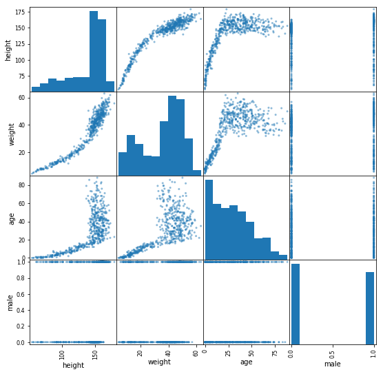

```python
# Матрица диаграмм рассеяния
import pandas as pd

hwa = pd.read_csv('hwa.csv', sep=';')
pd.plotting.scatter_matrix(hwa, figsize=(9, 9))
```



- В верхней левой ячейке связь роста с ростом. Это не диаграмма рассеяния, а обычная гистограмма распределения по росту. 
  Видно, что больше всего людей ростом 150–170 см.

- В ячейке ниже: связь роста и веса. Можно выделить две зоны: узкую полоску до 150 см и широкую — после.
  Выходит, до 150 см рост и вес увеличиваются равномерно, а после — идут вразнобой.

- Рост и возраст: до 150 см и 20 лет тесно связаны, затем зависимость перестаёт быть устойчивой. 
  Дело в том, что в детстве и подростковом периоде мы растём примерно одинаково, а вот в 20 лет можем оказаться 
  ростом и 150, и 180 см. Аналогично устроена связь «вес — возраст».

- Из диаграммы разброса в нижней левой ячейке можно сделать вывод, что рослых мужчин в среднем больше, 
  чем рослых женщин. Так же обстоит и с весом (соседняя ячейка `male-weight`).
 
- Гистограмма пола `male` свидетельствует, что в выборке чуть больше женщин.

- Гистограмма возраста `age` сообщает, что больше всего информации собрано о детях младше 5 лет и совсем мало данных 
  о людях старше 75.

- Гистограмма веса `weight` имеет два пика: правый характерен для веса взрослых, а левый иллюстрирует всплеск значений 
  около 15–20 кг. Видимо, типичный вес дошкольника. Однако на гистограмме роста такого пика нет. Это может объясняться 
  тем, что в возрасте пяти лет дети активно прибавляют в росте, но не в весе. Вот и получилась большая 
  группа детей разного роста с весом около 20 кг: отсюда пик на гистограмме веса, без выдающихся соответствующих 
  значений на гистограмме роста.

- По другую сторону диагонали зеркально расположились те же данные, только оси поменялись местами. 
  Часто проще воспринимать графики, по которым взгляд скользит слева направо. Так, на графике `height-age` в верхней 
  строке (более наглядно, чем на графике `age-height`) видно, что люди старше 60 ниже ростом. 
  Обратите внимание, из этой корреляции не следует факт, что после 60 рост уменьшается. 
  Мы не наблюдали одних и тех же людей год за годом, так что можем лишь отметить, что в выборке пенсионеры 
  ростом меньше остальных взрослых.