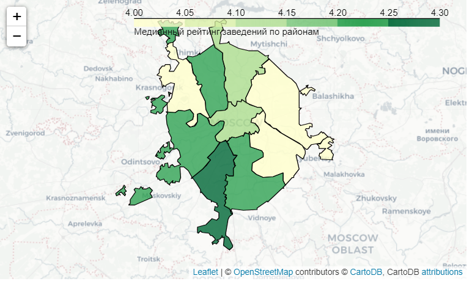
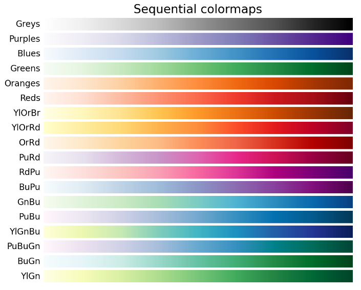

# Визуализация данных в геоаналитике - библиотека folium

## Вывод карты
```python
import folium

# moscow_lat - широта, moscow_lng – долгота
moscow_lat, moscow_lng = 55.751244, 37.618423
# создаём объект m – карту с центром в точке с координатами [moscow_lat, moscow_lng]
m = folium.Map(location=[moscow_lat, moscow_lng], zoom_start=16, tiles='Cartodb Positron')
# выводим карту
m
```

## Маркеры мест
```python
import folium

# сохраняем координаты Большого театра в переменные
bolshoi_theatre_lat, bolshoi_theatre_lng = 55.760082, 37.618668
# сохраняем координаты Малого театра в переменные
malyi_theatre_lat, malyi_theatre_lng = 55.759700, 37.6207130

# общий тип мест
place_type = 'Театр'

# создаём карту с центром в точке расположения Большого театра и начальным зумом 17
m = folium.Map(location=[bolshoi_theatre_lat, bolshoi_theatre_lng],\
               zoom_start=17, tiles='Cartodb Positron')
# создаём маркер в точке расположения Большого театра
# по наведению на точку отобразится «Театр» (tooltip)
# по нажатию на маркер отобразится окно с текстом «Большой театр»
folium.Marker([bolshoi_theatre_lat, bolshoi_theatre_lng],\
              tooltip=place_type,\
              popup='Большой театр')\
              .add_to(m)
# создаём маркер в точке расположения Малого театра и сразу добавляем на карту
# по наведению на точку отобразится «Театр» (tooltip)
# по нажатию на маркер отобразится окно с текстом «Малый театр»
folium.Marker([malyi_theatre_lat, malyi_theatre_lng],\
              tooltip=place_type,
              popup='Малый театр')\
              .add_to(m)

# выводим карту
m
```

## Кластеры
```python
from folium import Map, Marker
from folium.plugins import MarkerCluster

# moscow_lat - широта центра Москвы, moscow_lng - долгота центра Москвы
moscow_lat, moscow_lng = 55.751244, 37.618423

# создаём карту Москвы
m = Map(location=[moscow_lat, moscow_lng], zoom_start=10, tiles="Cartodb Positron")
# создаём пустой кластер, добавляем его на карту
marker_cluster = MarkerCluster().add_to(m)

# пишем функцию, которая принимает строку датафрейма,
# создаёт маркер в текущей точке и добавляет его в кластер marker_cluster
def create_clusters(row):
    Marker(
        [row['lat'], row['lng']],
        popup=f"{row['name']} {row['rating']}",
    ).add_to(marker_cluster)

# применяем функцию create_clusters() к каждой строке датафрейма
df.apply(create_clusters, axis=1)

# выводим карту
m
```

## Собственные иконки для маркеров
https://icons8.com/icons
```python
import pandas as pd
from folium import Map, Marker
from folium.plugins import MarkerCluster
from folium.features import CustomIcon

moscow_lat, moscow_lng = 55.751244, 37.618423
df = pd.read_csv('/datasets/moscow_malls_info.csv')

# создаём карту Москвы
m = Map(location=[moscow_lat, moscow_lng], zoom_start=10, tiles='Cartodb Positron')
# создаём пустой кластер, добавляем его на карту
marker_cluster = MarkerCluster().add_to(m)

def create_clusters(row):
    # сохраняем URL-адрес изображения со значком торгового центра с icons8,
    # это путь к файлу на сервере icons8
    icon_url = 'https://img.icons8.com/external-wanicon-flat-wanicon/344/external-mall-shop-and-store-wanicon-flat-wanicon.png'  
    # создаём объект с собственной иконкой размером 30x30
    icon = CustomIcon(icon_url, icon_size=(30, 30))
    
    # создаём маркер с иконкой icon и добавляем его в кластер
    Marker(
        [row['lat'], row['lng']],
        popup=f"{row['name']} {row['rating']}",
        icon=icon,
    ).add_to(marker_cluster)

# применяем функцию для создания кластеров к каждой строке датафрейма
df.apply(create_clusters, axis=1)

# выводим карту
m
```


## Фоновая картограмма (хороплет)
```python
from folium import Map, Choropleth

# загружаем JSON-файл с границами округов Москвы
state_geo = '/datasets/admin_level_geomap.geojson'
# moscow_lat - широта центра Москвы, moscow_lng - долгота центра Москвы
moscow_lat, moscow_lng = 55.751244, 37.618423

# создаём карту Москвы
m = Map(location=[moscow_lat, moscow_lng], zoom_start=10, tiles='Cartodb Positron')

# создаём хороплет с помощью конструктора Choropleth и добавляем его на карту
Choropleth(
    geo_data=state_geo,
    data=rating_df,
    columns=['district', 'rating'],
    key_on='feature.name',
    fill_color='YlGn',
    fill_opacity=0.8,
    legend_name='Медианный рейтинг заведений по районам',
).add_to(m)

# выводим карту
m
```


### Параметры хороплета
- `geo_data` — строка, которая содержит путь к GeoJSON-файлу с информацией о границах регионов. 
- `data` — датафрейм, который, помимо прочего, содержит геоданные — информацию о широте и долготе точек.
- `columns` — список столбцов датафрейма из `data`, которые нужно использовать при построении фоновой картограммы.
- `key_on` — строка, которая содержит название нужного ключа в JSON, например с названием региона.
  В начале строки указывают `feature.`, а затем название ключа. В GeoJSON-файле с данными Москвы названия округов 
  хранятся в ключе `name`, поэтому достаточно передать параметру `key_on` строку `'feature.name'`. 
  Библиотека найдёт ключ в JSON, достанет соответствующее ему значение и сопоставит его со строками датафрейма `data`.
- `fill_color` — строка, которая задаёт цветовую схему хороплета. 
- `fill_opacity` — дробное число от `0` до `1`, которое задаёт прозрачность заливки хороплета. 
- `legend_name` — строка с подписью к цветовой легенде графика.

### Цветовые схемы хороплета

