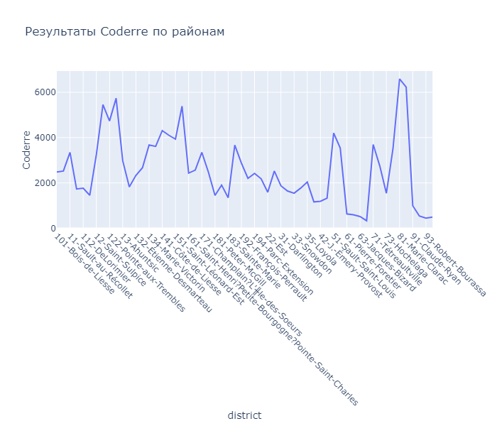
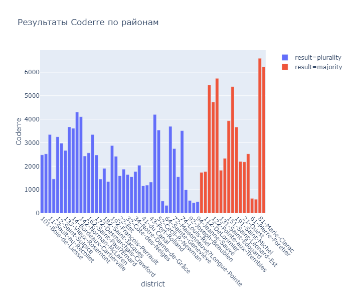

# Библиотека plotly
Plotly — библиотека самостоятельная<br>
Документация - https://plotly.com/python/#fundamentals

## Интерактивные графики
Интерактивные графики применять лучше всего:
- когда у вас действительно сложный линейный график или гистограмма с большим количеством данных. 
- когда для работы с графиком нужна возможность детализации отдельных его частей;
- когда на одном графике нужно разместить большое количество информации — её можно спрятать во всплывающих элементах.

## Линейный график - line()
```python
import plotly.express as px
data = px.data.election()
fig = px.line(data, x='district', y='Coderre', title='Результаты Coderre по районам')
fig.update_xaxes(tickangle=45) # повернём подписи по оси X на 45 градусов
fig.show() 
```



## Столбчатая диаграмма - bar()
```python
import plotly.express as px
data = px.data.election()
fig = px.bar(data, x='district', y='Coderre', color='result', title='Результаты Coderre по районам')
fig.update_xaxes(tickangle=45)
fig.show() 
```



## Круговая диаграмма graph_objects 