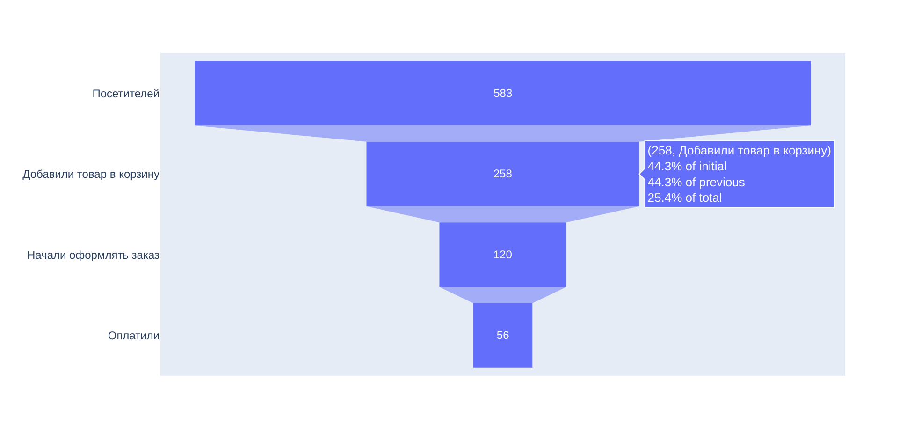

# Библиотека plotly
Plotly — самостоятельная библиотека для построения интерактивных графиков<br>
Документация - https://plotly.com/python/#fundamentals

## Интерактивные графики
Интерактивные графики применять лучше всего:
- когда у вас действительно сложный линейный график или гистограмма с большим количеством данных. 
- когда для работы с графиком нужна возможность детализации отдельных его частей;
- когда на одном графике нужно разместить большое количество информации — её можно спрятать во всплывающих элементах.

## Линейный график - express.line()
```python
import plotly.express as px
data = px.data.election()
fig = px.line(data, x='district', y='Coderre', title='Результаты Coderre по районам')
fig.update_xaxes(tickangle=45) # повернём подписи по оси X на 45 градусов
fig.show() 
```


## Столбчатая диаграмма - express.bar()
```python
import plotly.express as px
data = px.data.election()
fig = px.bar(data, x='district', y='Coderre', color='result', title='Результаты Coderre по районам')
fig.update_xaxes(tickangle=45)
fig.show() 
```


## Круговая диаграмма graph_objects.Pie() 
```python
from plotly import graph_objects as go

name_rest = ['Филиал 1', 'Филиал 2', 'Филиал 3', 'Филиал 4', 'Основной ресторан']
values = [18538, 12098, 8353, 15043, 23450]

fig = go.Figure(data=[go.Pie(labels=name_rest, values=values)])
fig.show() 
```


# График воронки graph_objects.Funnel()
```python
from plotly import graph_objects as go

fig = go.Figure(
    go.Funnel(
        y=[
            'Посетителей',
            'Добавили товар в корзину',
            'Начали оформлять заказ',
            'Оплатили',
        ],
        x=[583, 258, 120, 56],
    )
)
fig.show() 
```

