# Библиотека seaborn
Matplotlib — низкоуровневая библиотека для визуализации данных в Python.
Seaborn - надстройка над Matplotlib

## Стили
Документация по стилям Matplotlib - https://matplotlib.org/stable/users/explain/customizing.html

```python
import matplotlib.pyplot as plt

# Выведем список всех возможных стилей
print(plt.style.available)
"""
['bmh', 'classic', 'dark_background', 'fast', 'fivethirtyeight', 'ggplot', 'grayscale', 'seaborn-bright', 
'seaborn-colorblind', 'seaborn-dark-palette', 'seaborn-dark', 'seaborn-darkgrid', 'seaborn-deep', 'seaborn-muted', 
'seaborn-notebook', 'seaborn-paper', 'seaborn-pastel', 'seaborn-poster', 'seaborn-talk', 'seaborn-ticks', 
'seaborn-white', 'seaborn-whitegrid', 'seaborn', 'Solarize_Light2', 'tableau-colorblind10', '_classic_test'] 
"""

# Присвоить стили к нескольким графикам
with plt.style.context('seaborn-pastel'):
    plt.bar([10, 20, 30, 40],[3, 9, 18, 7]) 

# Задать общий стиль на весь проект
plt.style.use('ggplot')
```

## Метод jointplot()
Совмещает два распределения на одном графике

```python
import pandas as pd

taxi = pd.read_csv('/datasets/taxi_data.csv')
print(taxi.head())
```

```text
driver_id  rating  tips
0       3116     4.6     9
1       4742     6.1    12
2       3482     6.8     8
3       4155     8.0    12
4       3425     6.4     8 
```


```python
import seaborn as sns
import pandas as pd

taxi = pd.read_csv('/datasets/taxi_data.csv')
sns.jointplot(x='rating', y='tips', data=taxi) 
```
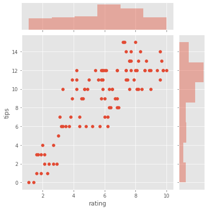

Добавим на график плотность распределения и регрессию. 
```python
sns.jointplot(x='rating', y='tips', data=taxi, kind='reg') 
```

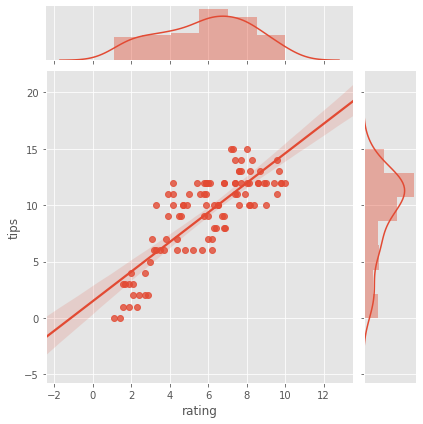

Получили положительную линейную корреляцию. 
Скорее всего, рейтинг водителя и чаевые зависят друг от друга.


## Цветовые палитры
Онлайн-сервисы с палитрами:
- https://colorhunt.co/
- http://fabianburghardt.de/swisscolors/
- https://flatuicolors.com/
- https://uxpro.cc/toolbox/visual-design/colors/

Документация - https://seaborn.pydata.org/tutorial/color_palettes.html#building-color-palettes

Вывод текущей палитры
```python
current_palette = sns.color_palette('coolwarm', 20)
print(sns.palplot(current_palette)) 
```

Задать палитру
```python
sns.set_palette('dark') 
```

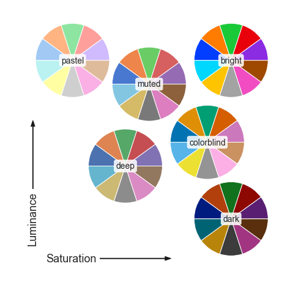


## Стили графиков

Заголовки и подписи осей графика - `set_title()`, `set_xlabel()` и `set_ylabel()`

Размер графика
```python
plt.figure(figsize=(12, 3)) # Важно! Этот код нужно писать до создания графика
ax = sns.lineplot(x='timepoint', y='signal', hue='event', style='event', data=fmri) 
```

Стиль графика
- 'darkgrid' — тёмная сетка;
- 'whitegrid' — белая сетка;
- 'dark' — тёмный;
- 'white' — белый;
- 'ticks' — штриховка.


## Категориальные данные
Документация - https://seaborn.pydata.org/tutorial/categorical.html

### Столбчатая диаграмма - barplot()
https://seaborn.pydata.org/generated/seaborn.barplot.html#seaborn.barplot

- `x` — данные по оси X;
- `y` — данные по оси Y;
- `data` — набор данных, по которому строят график;
- `color` или `palette` — цвет или палитра.
- `estimator` - метод для агрегации данных

```python
import seaborn as sns
from numpy import median

flights = sns.load_dataset('flights')
ax = sns.barplot(x='year', y='passengers', data=flights, estimator=median)
```
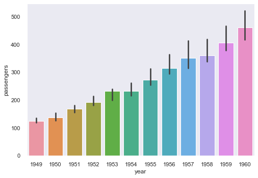


### Диаграмма размаха - boxplot()
```python
import seaborn as sns
sport = sns.load_dataset('exercise')
ax = sns.boxplot(x='diet', y='pulse', data=sport) 
```
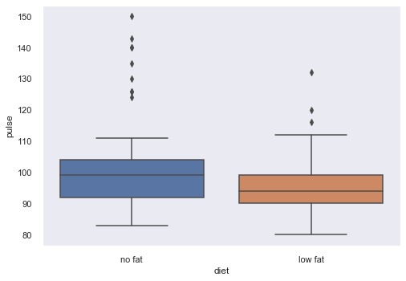

Помимо осей X и Y, можно добавить графику третье измерение.
Параметру `hue` (англ. «тон, оттенок») метода `boxplot()` передают столбец, из которого следует взять информацию:
```python
import seaborn as sns
sport = sns.load_dataset('exercise')
ax = sns.boxplot(x='kind', y='pulse', hue='diet', data=sport) 
```
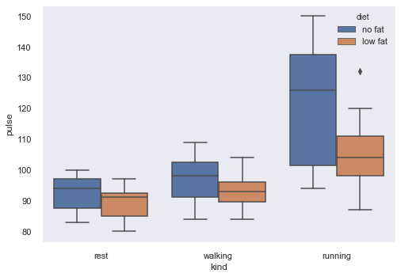


## Визуализация распределения

### График распределения одной величины - distplot()
```python
import seaborn as sns
sport = sns.load_dataset('exercise')
sns.distplot(sport['pulse'], bins=10) 
```
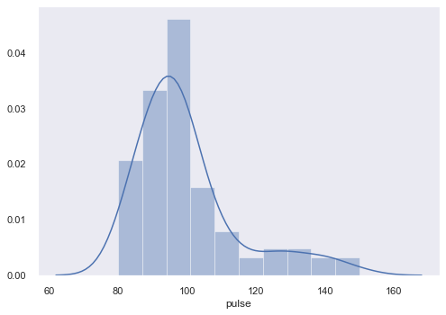

### График совместного распределения - pairplot()
```python
sns.pairplot(sport) 
```
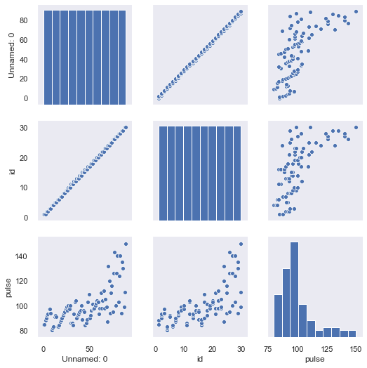

```python
sns.pairplot(sport, hue='diet') 
```
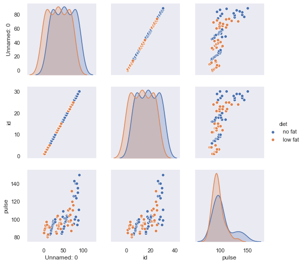


### График распределения и размаха - violinplot()
```python
sns.violinplot(x='kind', y='pulse', data=sport, palette='rainbow')
```
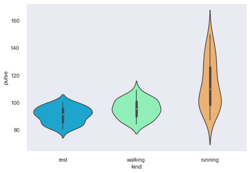

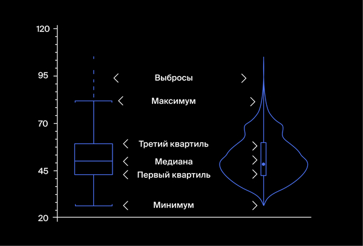


### Ддиаграмма рассеяния - stripplot()
```python
sns.stripplot(x='diet', y='pulse', data=sport)
```
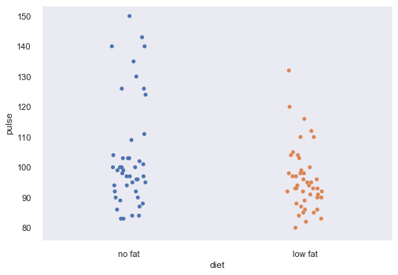